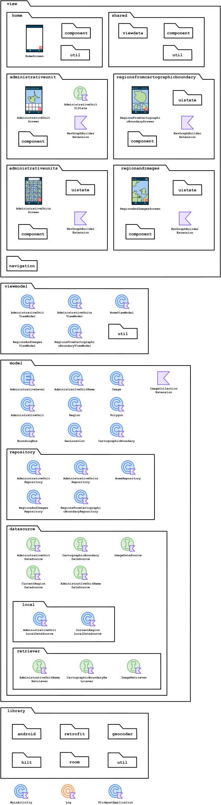
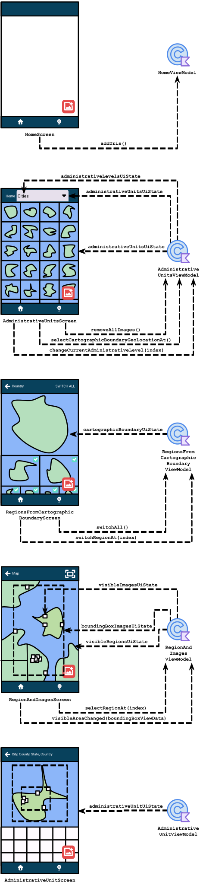
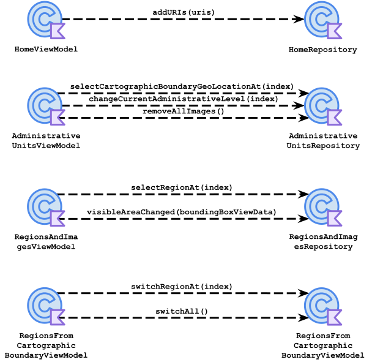
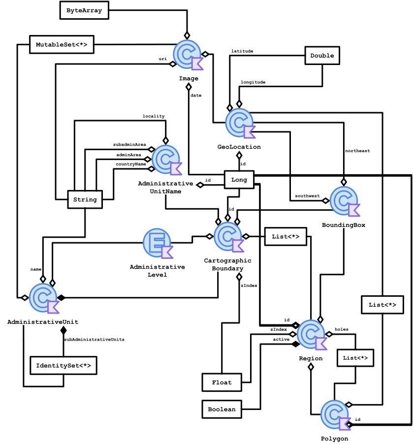
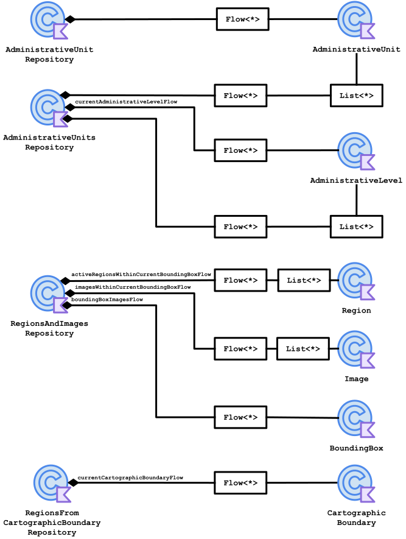

<h1 align="center">
  <br>
  Fridgnet
</h1>

<p align="center">
  <strong>Collect interesting places, and pin them in your map like a fridge magnet!</strong><br>
  This app shows you where all cities, counties, states, and countries your photos were taken. Each time you input a photo into the app, it will search for the city, county, state, and country, and then plot them on a map.
</p>

## Contents

- [Build & run](#build--run)
- [Documentation](#documentation)
- [Use Cases](#use-cases)
  - [Add Photos](#add-photos)
    - [Add Photos Flow](#add-photos-flow)
  - [Hide Exclaves](#hide-exclaves)
- [Technologies](#technologies)
- [Challenges](#challenges)
  - [JSON Format Handling](#json-format-handling)
  - [Clipping of locations](#clipping-of-locations)
- [Structure](#structure)
  - [Method Calling](#method-calling)
  - [Screen/ViewModel Relationship](#screenviewmodel-relationship)
  - [Implementation](#implementation)
  - [Aggregation](#aggregation)
  - [Composition](#composition)
  - [Aggregation With List](#aggregation-with-list)
  - [Composition With Mutable Map](#composition-with-list)
  - [Composition With Pair of Set](#composition-with-pair-of-set)
- [Diagrams](#diagrams)
  - [Package `io.schiar.fridgnet`](#package-ioschiarfridgnet)
  - [Package `view` and `viewmodel`](#package-view-and-viewmodel)
  - [Package `view.viewdata`](#package-viewviewdata)
  - [Package `viewmodel` and `view.viewdata`](#package-viewmodel-and-viewviewdata)
  - [Package `viewmodel` and `model.repository`](#package-viewmodel-and-modelrepository)
  - [Package `model`](#package-model)
  - [Package `model.repository` and `model`](#package-modelrepository-and-model)
  - [Package `model.repository`, `model.datasource` and `library`](#package-modelrepository-modeldatasource-and-library)
- [Future Tasks](#future-tasks)

## Build & Run

- This project contains a submodule library. Clone this project using the `--recurse-submodules` param in order to clone together with the library:

```bash
git clone --recurse-submodules git@github.com:giovanischiar/fridgnet.git
```
or

```bash
git clone --recurse-submodules https://github.com/giovanischiar/fridgnet.git
```

- If the project was already cloned, run this command:

```bash
git submodule update --init
```

- Go to Google Maps library and get a map API key. Go [here](https://developers.google.com/maps/documentation/embed/get-api-key) to learn how to create a API maps key.

- Create an `apikey.properties` file on the root of the project containing:

```
MAPS_API_KEY=/* Your Google Maps API key. */
```

- Open the project using [Android Studio](https://developer.android.com/studio).

## Documentation

The documentation for the whole project (public artifacts 100% documented) is available [here](https://giovanischiar.github.io/fridgnet-documentation/)

## Use Cases

### Add Photos

|&nbsp;&nbsp;&nbsp;&nbsp;&nbsp;&nbsp;&nbsp;&nbsp;&nbsp;&nbsp;&nbsp;&nbsp;&nbsp;&nbsp;&nbsp;&nbsp;&nbsp;&nbsp;&nbsp;Screenshot&nbsp;&nbsp;&nbsp;&nbsp;&nbsp;&nbsp;&nbsp;&nbsp;&nbsp;&nbsp;&nbsp;&nbsp;&nbsp;&nbsp;&nbsp;&nbsp;&nbsp;&nbsp;&nbsp;|Description|
|:-:|:-:|
||The app starts with a blank screen; that's the `HomeScreen`. Let's click on the red button to add photos.|
||That's the image picker system screen; you can select either one or multiple photos at once.|
||After selecting the photos, the app will search for the address where each photo was taken using its coordinates, group them by their cities, and show each city plotted on its own mini-map.|
||You can also see them grouped by county, state, or country by clicking on the dropdown.|
| |When you click on `Map` at the bottom tab, it shows the `MapScreen`. It's the world map where all countries, states, counties, and cities where every photo was taken are plotted together along with each photo.|
||The `PhotosScreen` is shown when you click on any mini-map on the `HomeScreen`. The map of the city is plotted along with its photos at each coordinate, and there's a complete list of the photos below it.|

#### Add Photos Flow

  - The user sends the photos to the application using the Photo Picker.
  - The application extracts the GPS coordinates for each photo and sends them to the Geocoder.
  - The Geocoder finds the address for each GPS coordinate and returns to the application.
  - The application extracts the names of all the different levels of administrative regions (city, county, state, and country) for each address and sends each one to the Nominatim API.
  - The Nominatim API returns a JSON containing the list of coordinates that mark the outline of each level of administrative region.
  - The application plots the coordinates of each administrative region and connects them, forming polygons, using Google Map Components to show them to the user.

### Hide Exclaves

|&nbsp;&nbsp;&nbsp;&nbsp;&nbsp;&nbsp;&nbsp;&nbsp;&nbsp;&nbsp;&nbsp;&nbsp;&nbsp;&nbsp;&nbsp;&nbsp;&nbsp;&nbsp;&nbsp;Screenshot&nbsp;&nbsp;&nbsp;&nbsp;&nbsp;&nbsp;&nbsp;&nbsp;&nbsp;&nbsp;&nbsp;&nbsp;&nbsp;&nbsp;&nbsp;&nbsp;&nbsp;&nbsp;&nbsp;|Description|
|:-:|:-:|
||Sometimes, there are locations that have [exclaves](https://en.wikipedia.org/wiki/Enclave_and_exclave). Take a look at San Francisco. As you can see, the Farallon Islands are part of San Francisco. However, the map becomes too small when including these islands. To hide the islands on the map, go to the `MapScreen` and click on the San Francisco territory.|
||This screen is the `PolygonsScreen`; it allows you to hide exclaves by clicking on the checkbox in the upper corner of each map. You can uncheck them one by one or click on `switch all` to check or uncheck all of them at once.|
||Now the `HomeScreen` shows the mini-map of San Francisco without taking into account those islands. Therefore, it appears bigger than before. This change will also apply to both the `PhotosScreen` and `MapScreen`.|
||You can do it even with countries, counties, or states, like, for example, the United States. You'll be surprised at how many overseas territories a country has.|

# Technologies
|Technology|Purpose|
|:-:|:-:|
|<br>[Jetpack Compose](https://developer.android.com/jetpack/compose)|Design UI|
|<br>[Geocoder](https://developers.google.com/maps/documentation/javascript/reference/geocoder)|Convert coordinates into addresses|
|<br>[Nominatim](https://nominatim.openstreetmap.org/ui/about.html)|Retrieve coordinates of the outline of administrative regions|
|<br>[Room](https://developer.android.com/jetpack/androidx/releases/room)|Cache Nominatim JSONs data, and persist application data|
|<br>[GSON](https://github.com/google/gson)|Convert Nominatim JSON data into Kotlin objects|
|<br>[IconCreator](https://github.com/giovanischiar/icon-creator)|Generate application Icon (my own library)|

## Challenges

### JSON Format Handling
  - The challenge was to handle the JSON response format that Nominatim returns when searching for a location. When you search for a location to get its polygon coordinates, it returns them using the [GeoJSON format](https://datatracker.ietf.org/doc/html/rfc7946). Among other types, this application recognizes these 4:
    - [`Point`](https://datatracker.ietf.org/doc/html/rfc7946#section-3.1.2)
      
      ```javascript
          {
            "type": "Point",
            "coordinates": [1.23, 14.42]
          }
      ```
      
      This type is straightforward; it's only a single coordinate that follows the format `[longitude, latitude]`. All of the following types also use this same coordinate format.
    - [`LineString`](https://datatracker.ietf.org/doc/html/rfc7946#section-3.1.4)
      
      ```javascript
          {
            "type": "LineString",
            "coordinates": [[2, 9], [4, 2], [5, 3], /* ... */]
          }
      ```
      
      This type is an array of `Point`. It is used to return the coordinates of streets.
    - [`Polygon`](https://datatracker.ietf.org/doc/html/rfc7946#section-3.1.6)
      
      ```javascript
          {
            "type": "Polygon",
            "coordinates": [
              [[0, 0], /*...*/, [0, 0]] // This first array is the polygon that represents the outermost polygon. First and last coordinates must be the same
              [[0.1, 0.1], /*...*/, [0.1, 0.1]] // any subsequent arrays in this list are handled as holes inside the polygon
              /* ... */
            ]
          }
      ```
      
      This type is one of the main ones used in the application to draw the outline of cities, counties, states, and countries. This type considers that the location is only one closed polygon with possible holes within, where the first list represents the coordinates of the polygon itself while the other ones represent the possible inside holes.
    - [`MultiPolygon`](https://datatracker.ietf.org/doc/html/rfc7946#section-3.1.7)

      This other type is used to draw locations that contain more than one polygon, like the United States, which has Alaska and Hawaii as outlying states. It's an array of `Polygon`.

    Although only `Polygon` and `Multipolygon` are used to plot locations on the map, there were times when the API returned `Point` or `LineString`, making me have to handle those types as well. The issue was that the `coordinates` field had a variable type, so I had to learn how to create a custom JSON deserializer when converting the JSON into Kotlin objects.

### Clipping of polygons

  - The application, especially the 'MapScreen', mainly consists of rendering polygons on a map. These polygons are a list of several coordinates outlining a region of the map when those coordinates are connected to each other. As many polygons are rendered on the map, the heavier the calculations the app would need to do, making the app very slow. That's when the classical Computer Graphics method called [clipping](https://en.wikipedia.org/wiki/Clipping_(computer_graphics)) comes in handy. It prevents the app from rendering unnecessary polygons that the screen is not presenting at the moment. To make this clipping algorithm happen, I started drawing on paper all the possible cases where a polygon shouldn't be rendered because it is not visible on the screen. Let's take a look at the digitized (and enhanced) version:

  <picture>
    <source media="(prefers-color-scheme: dark)" srcset="./readme-res/clipping-challenge/dark/clipping-visual-tests.dark.svg">
    
  </picture>

  As you can see, the big rectangle at the center is the visible area of the map at the moment; I call it `bounds`. To simplify, instead of comparing each coordinate of each polygon against the coordinates of `bounds`, I compare its `southeast` and `northeast` coordinates. Let's take a closer look at what those rectangles mean.

  <picture>
    <source media="(prefers-color-scheme: dark)" srcset="./readme-res/clipping-challenge/dark/clipping-test-legend.dark.svg">
    
  </picture>

  ```kotlin
  @Test // 26
  fun `Polygon with southwest and northeast different from bounds south of bounds`() { /* .. */ }
  ```

  For each polygon, I calculated its `boundingbox`, which consists of its `southwest` and `northeast` coordinates. These coordinates create a box that encloses the polygon. Each `boundingbox` around `bounds` is numbered, and then for each one, I wrote a test labeled after its relative position to `bounds`. Here's a slightly modified excerpt of [PolygonsOutsideBoundsTest.kt](https://github.com/giovanischiar/fridgnet/blob/main/app/src/test/java/io/schiar/fridgnet/model/boundingbox/PolygonsOutsideBoundsTest.kt) showing that each unit test corresponds to a numbered `boundingbox` drawn on the diagram:
    
  ```kotlin
  /* ... */

  @Test // 1
  fun `Polygon with southwest latitude equals bounds southwest latitude west of bounds`() {/* ... */}

  @Test // 2
  fun `Polygon with southwest latitude equals bounds southwest latitude east of bounds`() {/* ... */}

  @Test // 3
  fun `Polygon with southwest longitude equals bounds southwest longitude south of bounds`() {/* ... */}

  @Test // 4
  fun `Polygon with southwest longitude equals bounds southwest longitude north of bounds`() {/* ... */}

  @Test // 5
  fun `Polygon with southwest latitude equals bounds northeast latitude west of bounds`() {/* ... */}

  @Test // 6
  fun `Polygon with southwest latitude equals bounds northeast latitude east of bounds`() {/* ... */}

  @Test // 7
  fun `Polygon with southwest longitude equals bounds northeast longitude south of bounds`() {/* ... */}

  @Test // 8
  fun `Polygon with southwest longitude equals bounds northeast longitude north of bounds`() {/* ... */}

  /* ... */
  ``` 
    

  The tests in this file only cover whether the algorithm correctly returns `false` for those polygons outside of `bounds`. Another file covers the opposite case. There are also other tests that cover even more scenarios; for example, how the algorithm will behave if the [antimeridian](https://en.wikipedia.org/wiki/180th_meridian) is visible? Or what if there is a polygon that crosses that meridian? Every case was thoroughly considered, and its files are inside the [boundingbox folder](https://github.com/giovanischiar/fridgnet/tree/main/app/src/test/java/io/schiar/fridgnet/model/boundingbox) in the tests.

## Structure
Before presenting the diagrams, I will introduce the notation I used to create them.
  
### Diagram Elements
<picture>
  <source media="(prefers-color-scheme: dark)" srcset="./readme-res/structure/dark/diagram-elements.dark.svg">
  
</picture>

### Method Calling
<picture>
  <source media="(prefers-color-scheme: dark)" srcset="./readme-res/structure/dark/method-calling.dark.svg">
  
</picture>

```kotlin
class AppViewModel(private val repository: AppRepository) : ViewModel { 
  /*...*/ 
    suspend fun addURIs(uris: List<String>) {
        repository.addURIs(uris = uris)
    }
}
```

### Screen/ViewModel Relationship
<picture>
  <source media="(prefers-color-scheme: dark)" srcset="./readme-res/structure/dark/screen-viewmodel-relationship.dark.svg">
  
</picture>

```kotlin
@Composable
fun HomeScreen(viewModel: HomeViewModel, /*...*/) {
  /*...*/
  LaunchedEffect(Unit) { viewModel.subscribe() }
  val addressLocationImages by viewModel.addressLocationImages.collectAsState()
  /*...*/
}
```

### Implementation
<picture>
  <source media="(prefers-color-scheme: dark)" srcset="./readme-res/structure/dark/implementation.dark.svg">
  
</picture>

```kotlin
class MainRepository : HomeRepository { /*...*/ }
```

### Aggregation
<picture>
  <source media="(prefers-color-scheme: dark)" srcset="./readme-res/structure/dark/aggregation.dark.svg">
  
</picture>

```kotlin
data class Region(
   private val boundingBox : BoundingBox
)
```

### Composition
<picture>
  <source media="(prefers-color-scheme: dark)" srcset="./readme-res/structure/dark/composition.dark.svg">
  
</picture>

```kotlin
data class Address(
   private val administrativeUnit : AdministrativeUnit = CITY
)
```

### Aggregation With List
<picture>
  <source media="(prefers-color-scheme: dark)" srcset="./readme-res/structure/dark/aggregation-list.dark.svg">
  
</picture>

```kotlin
data class Region(
   private val holes : List<Polygon>
)
```

### Composition With Mutable Map
<picture>
  <source media="(prefers-color-scheme: dark)" srcset="./readme-res/structure/dark/composition-mutable-map.dark.svg">
  
</picture>

```kotlin
class MainRepository {
   private val locationAddress: MutableMap<Address, Location> = /*...*/
}
```

### Composition With Pair of Set
<picture>
  <source media="(prefers-color-scheme: dark)" srcset="./readme-res/structure/dark/composition-pair-set.dark.svg">
  
</picture>

```kotlin
class MainRepository {
   private val currentImages: Pair<Address, Set<Image>>? = /*...*/
}
```

## Diagrams
### Package `io.schiar.fridgnet`
  This diagram shows all the packages the application has, along with their structures. Some packages are simplified, while others are more detailed.

<picture>
  <source media="(prefers-color-scheme: dark)" srcset="./readme-res/diagrams/dark/io-schiar-fridgnet-structure-diagram.dark.svg">
  
</picture>

### Package `view` and `viewmodel`
  These diagrams illustrate the relationship between screens from `view` and `viewmodel` classes. The arrows from the View Models represent View Data objects (classes that hold all the necessary data for the view to display), primitives, or collections encapsulated by [State Flows](https://kotlinlang.org/api/kotlinx.coroutines/kotlinx-coroutines-core/kotlinx.coroutines.flow/-state-flow/), which are classes that encapsulate data streams. Every update in the View Data triggers the State Flow to emit these new values to the `view`, and the view updates automatically. Typically, the methods called from screens in `view` to classes in `viewmodel` trigger these changes, as represented in the diagram below by arrows from the `view` screens to `viewmodel` classes.

<picture>
  <source media="(prefers-color-scheme: dark)" srcset="./readme-res/diagrams/dark/view-view-model-diagram.dark.svg">
  
</picture>

### Package `view.viewdata`
  View Datas are classes that hold all the data the `view` needs to present. They are created from `model` classes and served by View Models to the `view`. This diagram represents all the associations among the classes in the `view.viewdata`.

<picture>
  <source media="(prefers-color-scheme: dark)" srcset="./readme-res/diagrams/dark/viewdata-diagram.dark.svg">
  
</picture>

### Package `viewmodel` and `view.viewdata`
  View Models serve the `view` with objects made from `view.viewdata` classes, collections, or primitive objects encapsulated by State Flows. This diagram represents all the associations among the classes in `viewmodel` and `view.viewdata`.

<picture>
  <source media="(prefers-color-scheme: dark)" srcset="./readme-res/diagrams/dark/viewmodel-viewdata-diagram.dark.svg">
  
</picture>

### Package `viewmodel` and `model.repository`
  View Models also serve as a [façade](https://en.wikipedia.org/wiki/Facade_pattern), triggering methods in `model.repository` classes. This diagram shows that each View Model has its own repository class and illustrates all methods each View Model calls, represented by arrows from View Models to Repositories.

<picture>
  <source media="(prefers-color-scheme: dark)" srcset="./readme-res/diagrams/dark/viewmodel-repository-diagram.dark.svg">
  
</picture>

### Package `model`
  Model classes handle the logic of the application. This diagram represents all the associations among the classes in the `model`.

<picture>
  <source media="(prefers-color-scheme: dark)" srcset="./readme-res/diagrams/dark/model-diagram.dark.svg">
  
</picture>

### Package `model.repository` and `model`
  These diagrams represent all the associations among the classes in `model.repository` and `model`.

<picture>
  <source media="(prefers-color-scheme: dark)" srcset="./readme-res/diagrams/dark/repository-model-diagram.dark.svg">
  
</picture>
<picture>
  <source media="(prefers-color-scheme: dark)" srcset="./readme-res/diagrams/dark/address-geocoder-db-repository-diagram.dark.svg">
  
</picture>
<picture>
  <source media="(prefers-color-scheme: dark)" srcset="./readme-res/diagrams/dark/image-android-db-repository-diagram.dark.svg">
  
</picture>
<picture>
  <source media="(prefers-color-scheme: dark)" srcset="./readme-res/diagrams/dark/location-api-db-repository-diagram.dark.svg">
  
</picture>

### Package `model.repository`, `model.datasource`, and `library`
  Data Sources provide their repositories with all the needed data for the application. They contain modules that make requests to the Nominatim API and consult the database. This diagram represents all the associations among the classes in `model.repository`, `model.datasource`, and `library`.

<picture>
  <source media="(prefers-color-scheme: dark)" srcset="./readme-res/diagrams/dark/repository-datasource-library-diagram.dark.svg">
  
</picture>

## Future Tasks
  - Fix Bugs:
    - The Geocoder library sometimes doesn't get the address of the locations right, and the Nominatim API sometimes doesn't return the right outline for the location. A solution would be to let the user search and correct the location.
    - The `PhotosScreen` displays a map with photos pinned at their respective coordinates, along with a grid of all the photos. It is accessed by clicking on the mini-map at the `HomeScreen`. However, it now only functions when clicking on a city map. It does not work when changing the current level of administrative region on the dropdown located at the top of the `HomeScreen` to a county, state, or country.
    - In the [hide exclave](#hide-exclaves) feature, all the exclaves that belong to a city may also belong to its county, which belongs to the state, which belongs to the country. When you hide the exclave from a city, although on the `HomeScreen` the exclave from the city is hidden, it doesn't get hidden from the other levels of the administrative region. Thus, on the `MapScreen`, these exclaves are still showing. This happens because the app is not prepared for an exclave to belong to multiple locations.
  - Use the date of each photo to show not only where but also when the photo was taken.
  - Create a dark mode.
  - Although unit tests were created to test the clipping, there are many other tests I'd like to create for this application.