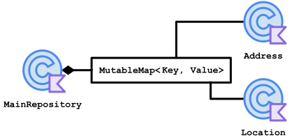
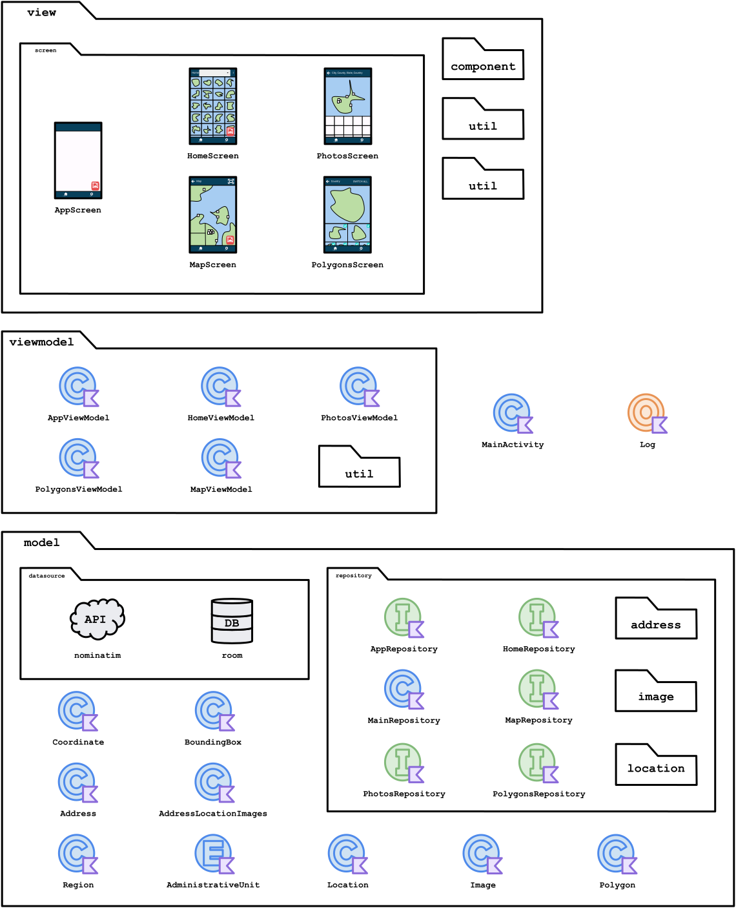

<h1 align="center">
  <br>
  Fridgnet
</h1>

<p align="center">
  <strong>Collect interesting places and pin in your map like a fridge magnet! </strong><br>
  This app shows for you all cities, counties, states and countries your photos was taken, each time you input a photo in the app, the app will search for the city and then show you
</p>

## Contents

- [Use Cases](#use-cases)
  - [Add Photos](#add-photos)
    - [Add Photos Flow](#add-photos-flow)
  - [Hide Exclaves](#hide-exclaves)
- [Technologies](#technologies)
- [Challenges](#challenges)
  - [JSON Format Handling](#json-format-handling)
  - [Clipping of locations](#clipping-of-locations)
- [Structure](#structure)
  - [Implementation](#implementation)
  - [Aggregation](#aggregation)
  - [Composition](#composition)
  - [Aggregation With List](#aggregation-with-list)
  - [Composition With Mutable Map](#composition-with-list)
  - [Composition With Pair of Set](#composition-with-pair-of-set)
- [Diagrams](#diagrams)
  -[Whole Project](#whole-project)
  -[View/ViewModel Relationship](#view/viewmodel-relationship)
  -[ViewModel/Repository Relationship](#viewModel/repository-relationship)
  -[Model](#model)

## Use Cases

### Add Photos

|&nbsp;&nbsp;&nbsp;&nbsp;&nbsp;&nbsp;&nbsp;&nbsp;&nbsp;&nbsp;&nbsp;&nbsp;&nbsp;&nbsp;&nbsp;&nbsp;&nbsp;&nbsp;&nbsp;Screenshot&nbsp;&nbsp;&nbsp;&nbsp;&nbsp;&nbsp;&nbsp;&nbsp;&nbsp;&nbsp;&nbsp;&nbsp;&nbsp;&nbsp;&nbsp;&nbsp;&nbsp;&nbsp;&nbsp;|Description|
|:-------------------------------------------------------------------------------------------:|:-------------------------------------------------------------------------------------------------------------------------------------------------------------------------------------------------------------------------------:|
|                          |                                                            The app starts with a blank screen; that's the `HomeScreen`. Let's click on the red button to add photos.                                                            |
|                  |                                                                      Thats's the image picker system screen, you can select one or multiple photos at once.                                                                     |
|                         |                 After selecting the photos, the app will search for the address where each photo was taken using its coordinates, group them by their cities, and show each city plotted on their own mini map.                 |
|  |                                                                     You can also see them grouped by county, state, and country by clicking on the dropdown.                                                                    |
|                          | When you click on `Map` at the bottom tab it shows the `MapScreen`. It's the world map where all countries, states, counties, and cities in which every place the photos where taken is plotted together along with each photo. |
|                       |             The `PhotosScreen` is shown when you click on one mini map on Home Screen. The map of the city is plotted along with its photos on each coordinate, and there's a complete list of the photos below it.             |

#### Add Photos Flow

  - User click on add image, they are able to add as many images they want
  - APP reads the metadata of the image and extract the GPS coordinate of each photo
  - APP send each photo coordinate to Geocoder
  - Geocoder return with an `Address` object, these `Address` contains many data, including `locality`, `subAdminArea`, `adminArea` and `countryName`
  - APP then send each of theses address data to Nominatim API
  - Nominatim API return an JSON with the polygon coordinates of the location
  - APP convert the JSON into Location objects
  - APP group images of same Location and show on Home Screen the grid of unique Locations represented by the polygon coordinates plotted on Google Maps components
  - On Map screen, each location is plotted together on a Google Maps Screen with each photo placed where taken
  - When user click on any Google Maps component in the Home screen they are show other Screen with a bigger location map with each photo added shown on Map with each photo located where taken, and also listed it above the map

### Hide Exclaves

|&nbsp;&nbsp;&nbsp;&nbsp;&nbsp;&nbsp;&nbsp;&nbsp;&nbsp;&nbsp;&nbsp;&nbsp;&nbsp;&nbsp;&nbsp;&nbsp;&nbsp;&nbsp;&nbsp;Screenshot&nbsp;&nbsp;&nbsp;&nbsp;&nbsp;&nbsp;&nbsp;&nbsp;&nbsp;&nbsp;&nbsp;&nbsp;&nbsp;&nbsp;&nbsp;&nbsp;&nbsp;&nbsp;&nbsp;|Description|
|:-----------------------------------------------------------------------------------------------------:|:-------------------------------------------------------------------------------------------------------------------------------------------------------------------------------------------------------------------------------------------------------------------------------------------------------------:|
|         | Sometimes, there are locations that own exclaves. Take a look of San Francisco. As you can see, the  Farallon Islands is part of San Francisco. However, the map becomes too small when including theses islands. To hide the islands on the map, go to `MapScreen` and click on the San Francisco territory. |
|                 |                                           This screen is the `PolygonsScreen`; it allows you to hide exclaves by clicking on the check on the upper corner of each map. you can uncheck one-by-one or click on `switch all` to check or uncheck all of them at once.                                          |
|  |                                                   Now the `HomeScreen` shows the mini map of San Francisco without taking account those islands. Therefore, it shows bigger than before. This change will also applies both `PhotosScreen` and `MapScreen`.                                                   |
|                 |                                                                         You can do it even with countries, counties or states, like for example, the United States. you'll be surprised how many overseas territories a country have.                                                                         |

# Technologies
|Technology|Purpose|
|:---------------------------------:|:-:|
|<br>[Jetpack Compose](https://developer.android.com/jetpack/compose)|Designing UI|
|<br>[Geocoder](https://developers.google.com/maps/documentation/javascript/reference/geocoder)|Convert coordinates into Addresses|
|<br>[Nominatim](https://nominatim.openstreetmap.org/ui/about.html)|Caching nominatim JSON responses and persistance|
|<br>[Room](https://developer.android.com/jetpack/androidx/releases/room)|Convert Nominatim JSON data returned by Nominatim API into Kotlin objects|
|<br>[GSON](https://github.com/google/gson)|Convert Nominatim JSON data returned by Nominatim API into Kotlin objects|
|<br>[IconCreator](https://github.com/giovanischiar/icon-creator)|My own library that generate the application icon|

## Challenges

### JSON Format Handling
  - The challenge was to handle the JSON response format that Nominatim returns when searching for a location. When you search for a location to get its coordinates, it returned using the [geojson format](https://datatracker.ietf.org/doc/html/rfc7946). Among other types, this application recognize 4 different types:
    - [`Point`](https://datatracker.ietf.org/doc/html/rfc7946#section-3.1.2)
      
      ```javascript
          {
            "type": "Point",
            "coordinates": [1.23, 14.42]
          }
      ```
      
      This type is straightfoward, it's only a single coordinate where follow the format `[longitude, latitude]`. All of the following types also use this same coordinate format
    - [`LineString`](https://datatracker.ietf.org/doc/html/rfc7946#section-3.1.4)
      
      ```javascript
          {
            "type": "LineString",
            "coordinates": [[2, 9], [4, 2], [5, 3], /* ... */]
          }
      ```
      
      This type is now an array of `Point`. It is used to return the coordinates of streets
    - [`Polygon`](https://datatracker.ietf.org/doc/html/rfc7946#section-3.1.6)
      
      ```javascript
          {
            "type": "Polygon",
            "coordinates": [
              [[0, 0], /*...*/, [0, 0]] // This first array it's the polygon that represent the outermost polygon. End and start coordinates must be the same
              [[0.1, 0.1], /*...*/, [0.1, 0.1]] // any subsequent arrays in this list are handled as holes inside the polygon
              /* ... */
            ]
          }
      ```
      
      This type its one of the effective used in the aplication to draw the outline of cities, counties, states, and countries. This type consider that the location is only one closed polygon with possible holes within.
    - [`MultiPolygon`](https://datatracker.ietf.org/doc/html/rfc7946#section-3.1.7)

      This other second effective type is used to draw locations that contain more than one polygon, like United States that have Alaska and Hawaii as ultramarine states. Its an array of `Polygon`

    Altough only `Polygon` and ` Multipolygon` are used to plot locations on the map, when I was searching for the locations, there was times that the API returned `Point` or `LineString` making me have to handle those types, too.
    The point was the `coordinates` field has a variable type, so I had to learn how to create a custom JSON deserializer when convert the JSON into Kotlin objects

### Clipping of polygons
  - Plot those polygons as the locations grow became a very onerous task. So to solve that I implemented clipping of theses polygons. That way the app won't draw polygons that are not visible. I created some tests to aid me in this task. Before I created theses tests I draw on paper each possible case a polygon should not be drawn by the app. Let's take a look of the digitalized (and enhanced) version: 
  <picture>
    <source media="(prefers-color-scheme: dark)" srcset="./readme-res/clipping-visual-tests.dark.svg">
    
  </picture>
  As you can see, the big rectangle at the center is the visible area of the map at the moment; I call it `bounds`. To simplify it, instead of compare each coordinate of each polygon against `bounds`'s coordinates, I compare its `southeast` and `northeast` coordinates. Let's take a closer look of what those rectangles mean 
  <picture>
    <source media="(prefers-color-scheme: dark)" srcset="./readme-res/clipping-test-legend.dark.svg">
    
  </picture>

  ```kotlin
  @Test // 26
  fun `Polygon with southwest and northeast different from bounds south of bounds`() { /* .. */ }
  ```

  For each polygon I calculated its `boundingbox` that consists of its `southwest` and `northeast` coordinates. These coordinates create a box that encloses the polygon. Each `boundingbox` around `bounds` is numerated and then to each one I wrote a test that was labeled after its relative position to `bounds`. Here's a slighty modified exerpt of [PolygonsOutsideBoundsTest.kt](https://github.com/giovanischiar/fridgnet/blob/main/app/src/test/java/io/schiar/fridgnet/model/boundingbox/PolygonsOutsideBoundsTest.kt) showing that each unit test corresponds a numbered `boundingbox` drawn on the diagram:
    
      ```kotlin
      /* ... */

      @Test // 1
      fun `Polygon with southwest latitude equals bounds southwest latitude west of bounds`() {/* ... */}

      @Test // 2
      fun `Polygon with southwest latitude equals bounds southwest latitude east of bounds`() {/* ... */}

      @Test // 3
      fun `Polygon with southwest longitude equals bounds southwest longitude south of bounds`() {/* ... */}

      @Test // 4
      fun `Polygon with southwest longitude equals bounds southwest longitude north of bounds`() {/* ... */}

      @Test // 5
      fun `Polygon with southwest latitude equals bounds northeast latitude west of bounds`() {/* ... */}

      @Test // 6
      fun `Polygon with southwest latitude equals bounds northeast latitude east of bounds`() {/* ... */}

      @Test // 7
      fun `Polygon with southwest longitude equals bounds northeast longitude south of bounds`() {/* ... */}

      @Test // 8
      fun `Polygon with southwest longitude equals bounds northeast longitude north of bounds`() {/* ... */}

      /* ... */
      ``` 
    
      The tests of this file only cover if the algorithm correctly returns `false` to those outside of `bounds`. Besides other file that cover the opposite case, there are other tests that covers further more; for example, how the algorithm will behave if the [antimeridian](https://en.wikipedia.org/wiki/180th_meridian) is visible? Or what if theres is a polygon that crosses that meridian? All cases was carefully considered and its files is inside the [boundingbox folder](https://github.com/giovanischiar/fridgnet/tree/main/app/src/test/java/io/schiar/fridgnet/model/boundingbox) in tests.

## Structure
Before showing the diagrams, I will introduce the notation I used to create it.
  
### Diagram Elements
<picture>
  <source media="(prefers-color-scheme: dark)" srcset="./readme-res/diagram-elements.dark.svg">
  
</picture>

### Implementation
<picture>
  <source media="(prefers-color-scheme: dark)" srcset="./readme-res/implementation.dark.svg">
  
</picture>

```kotlin
class MainRepository : HomeRepository { /*...*/ }
```

### Aggregation
<picture>
  <source media="(prefers-color-scheme: dark)" srcset="./readme-res/aggregation.dark.svg">
  
</picture>

```kotlin
data class Region(
   private val boundingBox : BoundingBox
)
```

### Composition
<picture>
  <source media="(prefers-color-scheme: dark)" srcset="./readme-res/composition.dark.svg">
  
</picture>

```kotlin
data class Address(
   private val administrativeUnit : AdministrativeUnit = CITY
)
```

### Aggregation With List
<picture>
  <source media="(prefers-color-scheme: dark)" srcset="./readme-res/aggregation-list.dark.svg">
  
</picture>

```kotlin
data class Region(
   private val holes : List<Polygon>
)
```

### Composition With Mutable Map
<picture>
  <source media="(prefers-color-scheme: dark)" srcset="./readme-res/composition-mutable-map.dark.svg">
  
</picture>

```kotlin
class MainRepository {
   private val locationAddress: MutableMap<Address, Location> = /*...*/
}
```

### Composition With Pair of Set
<picture>
  <source media="(prefers-color-scheme: dark)" srcset="./readme-res/composition-pair-set.dark.svg">
  
</picture>

```kotlin
class MainRepository {
   private val currentImages: Pair<Address, Set<Image>>? = /*...*/
}
```

## Diagrams
### Whole Project
<picture>
  <source media="(prefers-color-scheme: dark)" srcset="./readme-res/project-structure-diagram.dark.svg">
  
</picture>

### View/ViewModel Relationship
<picture>
  <source media="(prefers-color-scheme: dark)" srcset="./readme-res/view-view-model-diagram.dark.svg">
  
</picture>

The red dashed arrows that goes from View Model classes to View Classes show where each `MutableStateFlow` is used in View. The blue dashed arrows are the methods View called to View Model.

### ViewModel/Repository Relationship
<picture>
  <source media="(prefers-color-scheme: dark)" srcset="./readme-res/viewmodel-repository-diagram.dark.svg">
  
</picture>

### Model
<picture>
  <source media="(prefers-color-scheme: dark)" srcset="./readme-res/model-class-diagram.dark.svg">
  
</picture>